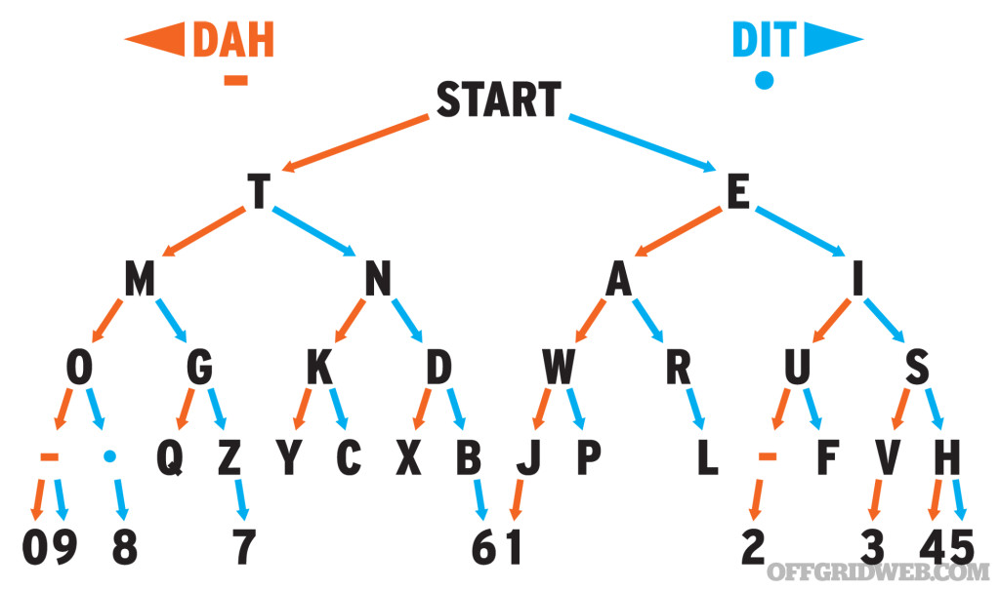

# Morse code terminal with receiver transmitter function
**Introduction**  
This is final project in TMP2 (Microprocessor Technology 2).
Using single button user codes specific letter, which is displayed on LCD screen and then send to the second terminal. The system can collect data from the other terminal simultaneously.
Project based on KL05Z

Working demonstration (pl): https://youtu.be/bLfkz5ub2K4

Final compilation
Program Size: Code=3928 RO-data=420 RW-data=8 ZI-data=360  
".\Objects\Project_Morse.axf" - 0 Error(s), 0 Warning(s).

**Implemented function**  
1) No blocking delays 
2) Software button debouncing with a possibility to add next buttons (universal use) - the only thing to do is to set pin, add next structure and in main function add handling function - PIT used
3) Displayed text sliding - if the display is filled with text the controller "moves" characters to the left making a space for new characters
4) Displaying decoded characters in the first row and the ones received from other terminal in the second row
5) Reliable and non blocking Morse code decoding based on PIT
6) No strict time frames - program will adapt to various typing speed (important for novice operators)
7) Program doesn't block even if the second terminal send data with high speeds
8) Wireless communication with other terminal up to 1km

**Used parts**  
1) KL05Z developing board
2) Button (or even telegraph key) for Morse code typing
3) LCD1602 display to display transmitted and received traffic
4) To radio modules HC-11 - one connected to KL05Z board and second to terminal like PC (with USB<->UART converter)

**Dynamic speed adaptation**  
To adapt various Morse code typing speed the user can speed up/slow down Morse code decoding speed
1) speeding up - by pressing for a short period of time (dot) - lower average time length of dot/dash
2) slowing down - by pressing for a long period of time (dash) - extend average time length of dot/dash
The user can in any moment (even if transmitting data) change typing speed

**Morse code diagram**  

  

**Authors:**  
Igor Kamiński EiT3
